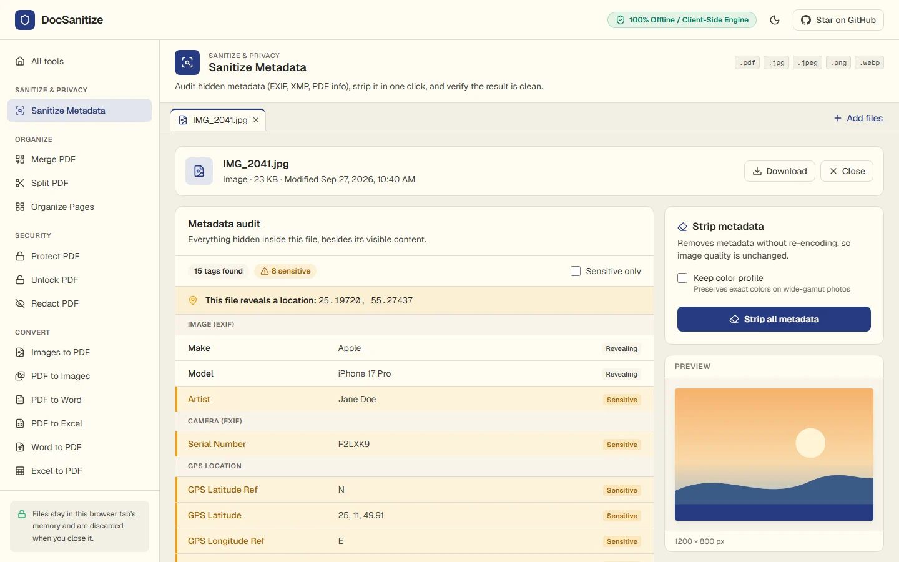
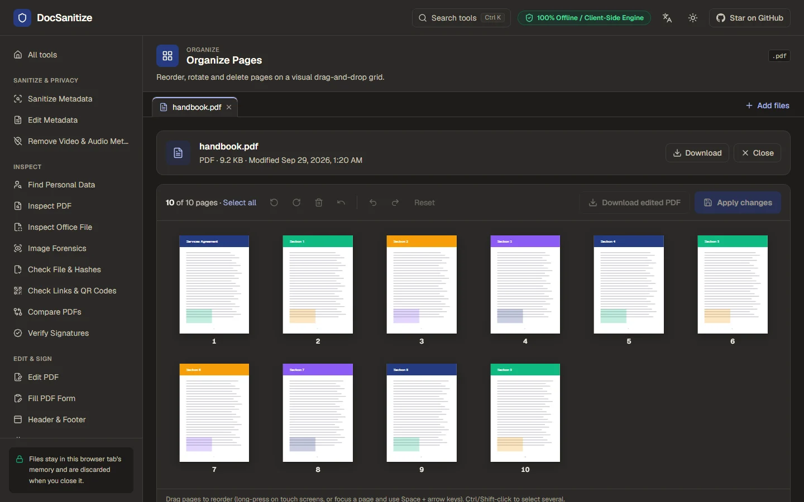
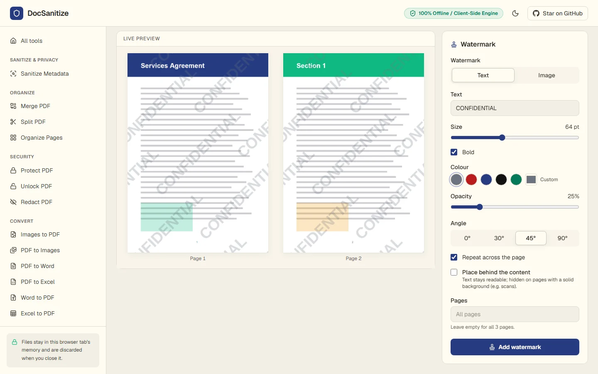
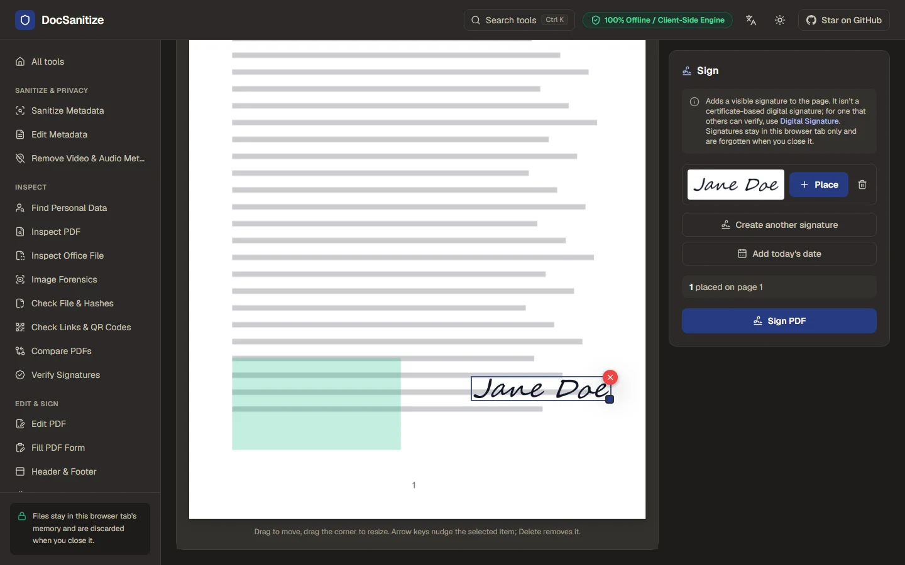
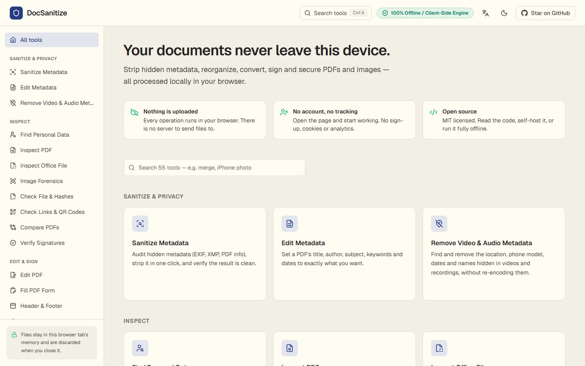
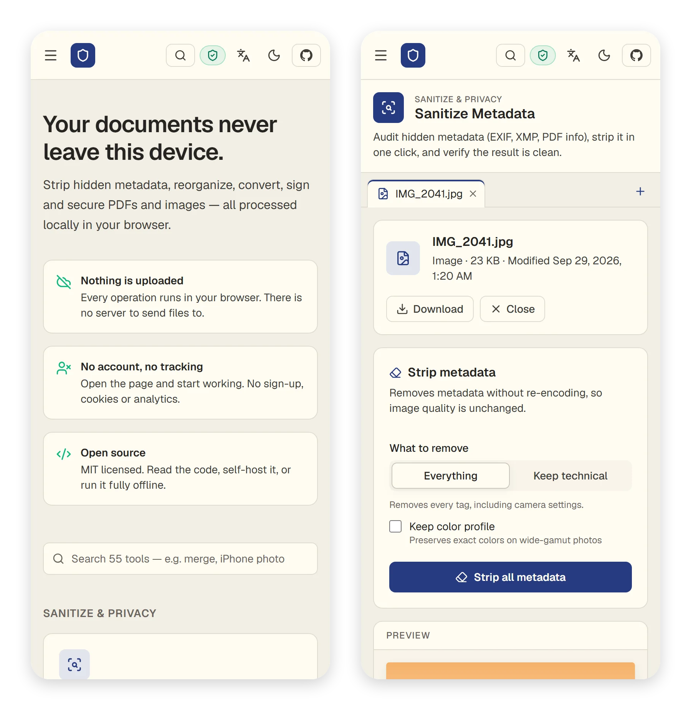
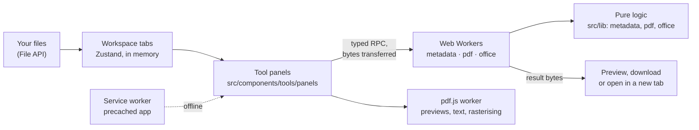

# DocSanitize

Free, private PDF and image tools that run entirely in your browser.

Strip hidden metadata from photos and documents, merge and split PDFs, convert to and from Word and Excel, make scans searchable with OCR, translate PDFs, redact, sign, watermark, password-protect and compress. There is no account and no server: your files are processed on your own device and are never uploaded.

**Live:** https://docsanitize.vercel.app · **Version:** 1.0.0

[](https://vercel.com/new/clone?repository-url=https%3A%2F%2Fgithub.com%2F4bdulllahh%2FDocSanitize&project-name=docsanitize&repository-name=docsanitize)
[](https://github.com/4bdulllahh/DocSanitize/actions/workflows/ci.yml)
[](LICENSE)



## Features

34 tools in six groups; press **Ctrl K** (**⌘K** on a Mac) anywhere to find one by name or by task, such as "combine" or "iPhone photo". Every file opens in its own tab and stays open as you move between tools, so you can sanitize a scan, merge it with another file, number the pages and password-protect the result without downloading in between. Each result is previewed before you download it.

### Sanitize and privacy

- **Sanitize Metadata.** Opens PDFs, JPEGs, PNGs, WebPs and iPhone HEIC and AVIF photos and lists everything hidden inside, from the author, device and serial number to editing software, dates, XMP history and the GPS location a photo was taken at. Each item is marked **Sensitive**, **Revealing** or **Technical**, and you can filter the list to check one kind at a time. One click removes it all, or, for photos, everything except technical data. The file is then read again from scratch to confirm nothing is left.
  - **Photos** are cleaned without re-encoding, so the image stays pixel-for-pixel identical. You can choose to keep the colour profile, or to keep all technical data (exposure, aperture, ISO, focal length, resolution and colour profile) while removing who, where, when and which device. Rotated photos keep only their orientation flag so they still display upright.
  - **PDFs** lose their document info, XMP metadata, document IDs, application data (PieceInfo), comment authors and dates, attachments, JavaScript and auto-run actions, and earlier saved versions of the file. Photos embedded in the PDF have their own EXIF and GPS data stripped too.
- **Edit Metadata.** Set a PDF's title, author, subject, keywords, creator, producer and dates to exactly what you choose; empty fields are removed, and so is the XMP copy that would contradict them.

### Edit and sign

- **Edit PDF.** One page for changing a document:
  - **Edit the document's own text:** click a line and retype it. The original words are removed from the file, not just covered.
  - **Add text** in a sans, serif or monospaced font, in any size and colour, bold or italic.
  - **Mark up:** white-out, highlight, underline and strikethrough that snap to the text, a pen and a see-through marker.
  - **Shapes and marks:** rectangles, ellipses, lines and arrows; check marks, crosses and dots for forms.
  - **Pictures and signatures:** images (including HEIC) and drawn, typed or uploaded signatures.
  - **Sticky notes** that open in any PDF reader.

  Everything can be selected, moved, resized, restyled, duplicated or deleted, with undo and redo, keyboard shortcuts and zoom. Save it **flattened** (part of the page, looks the same everywhere) or **editable** (real annotations other PDF apps can change). No author name or date is written into anything you add.
- **Fill PDF Form.** Fillable forms get a control over every field (text, check boxes, radio buttons, drop-downs and lists), mirrored in a list beside the page for keyboard and screen-reader users. Save it still fillable or flattened. Text in any Latin, Greek or Cyrillic script. PDFs without fields point you to Edit PDF.
- **Header & Footer.** Six positions (left, centre and right at the top and bottom) with `{page}`, `{pages}`, `{date}` and `{file}`, a live preview, and the choice of pages.
- **Bates Numbering.** One numbering sequence (prefix, zero-padded number, suffix) across every open PDF in tab order, as a ZIP.
- **Flatten PDF.** Draws filled-in form fields, comments, highlights and stamps into the page and removes them, so they can't be changed. Links keep working.
- **Bookmarks.** See, add, rename, re-target, nest and reorder a PDF's bookmarks.
- **E-Sign PDF.** Draw a signature with a mouse, pen or finger, type it in a handwriting font, or upload a photo of one (the white background is removed). Drag it into place, resize it and add today's date. Signatures are kept only until you close the tab.
- **Watermark.** Text or an image, in any of nine positions or repeated across the page, straight or angled, in any colour and opacity, on top of or behind the content, on all pages or the ones you choose. The live preview shows the real output.
- **Page Numbers.** "1", "1 / 9", "Page 1 of 9" or your own format, in six positions, with a starting number and the option to skip the cover page.

### Organize

- **Merge PDF.** Combine files in any order; drag to reorder.
- **Split PDF.** Pick pages on a thumbnail grid, type ranges (`1-3, 5, 8-`), or split into a new file every N pages or every page. Several files download as a ZIP.
- **Rotate PDF**, **Delete Pages** and **Insert Pages** (blank pages in any size, or pages from another open PDF) at a click, each on a page grid.
- **Crop PDF.** Drag a frame (or type the margins) for one page, some or all; or remove white margins automatically, page by page.
- **Resize Pages.** A4, Letter, Legal, A3, A5 or a custom size, keeping each page's orientation; content is scaled to fit and centred, and comments and links move with it.
- **Remove Blank Pages.** Finds pages with no text and next to no ink, including scanned ones, and removes the ones you confirm.
- **Organize Pages.** A drag-and-drop grid of page thumbnails: reorder, rotate and delete pages, select several with Ctrl or Shift, and undo or redo every step. Works with the keyboard and on touch screens.

### Security

- **Protect PDF.** Encrypts with AES-256 and lets you allow or block printing, copying and editing. A strength meter and a password generator help pick a good password. The result is opened with the password before you can download it, to prove it works.
- **Unlock PDF.** Removes the password (RC4, AES-128 or AES-256) from a PDF you have the password for, or the restrictions from one that opens without a password.
- **Redact PDF.** Draw boxes over anything, or search for text such as a name or account number and black out every match, including text typed into form fields. Redacted pages are rebuilt from an image, so the text, images and form fields under the boxes are gone for good, not just covered. Pages without redactions are left untouched.

### Convert

- **Images to PDF.** JPG, PNG, WebP, HEIC and AVIF to one PDF: fit each page to its image or use A4 or Letter, and choose the orientation, margins, and whether images fit or fill the page. Photos appear the right way up and their EXIF and GPS data is removed first.
- **HEIC to JPG.** Converts iPhone HEIC photos, and AVIF, WebP or PNG images, to JPG (with a quality setting) or PNG, several at once as a ZIP. Photos are turned upright and keep their colour profile; location, camera and date details aren't copied.
- **PDF to Images.** Every page or a selection, as JPG, PNG or WebP at 72 to 300 DPI. Several images download as a ZIP.
- **PDF to Word.** Rebuilds headings, paragraphs and page breaks in an editable `.docx`, dropping running headers and page numbers. Previewed in the app before you download.
- **PDF to Excel.** Detects table columns from the page layout and puts each page's table on its own sheet, with numbers stored as numbers. Previewed as a table first.
- **Word to PDF.** Headings, bold, italic and underlined text, numbered and bulleted lists, tables, links, footnotes and images from a `.docx`, laid out on A4 or Letter pages.
- **Excel to PDF.** `.xlsx`, `.xls`, `.ods` and `.csv`. Pick the sheets, page size and orientation. Hidden rows, columns and sheets are left out, merged cells and number formats are kept, and the header row repeats on every page.
- **OCR PDF.** Reads the text in scanned PDFs and in photos or screenshots, in 24 languages (up to three at once), and adds it as an invisible layer over each word, so the file can be searched, selected and copied while it looks the same. Pages that already have text are skipped. The text is also available as a `.txt` file or to copy. Runs [Tesseract](https://github.com/tesseract-ocr/tesseract) in the browser; the engine and each language are downloaded from this site the first time (see [Works offline](#works-offline)).
- **Translate PDF.** Translates a PDF with the translator built into Chrome and Edge on computers, which works on the device, and keeps the layout: each paragraph, heading or table cell is translated as a whole and written back in the same place and colour, smaller where the translation is longer, with the original text removed from the file. The language is detected automatically. Into languages the built-in font can't write (such as Arabic, Chinese or Hindi) you get the translated text as a `.txt` file. Other browsers are told to use Chrome or Edge; nothing is sent to an online service.

### Optimize

- **Grayscale PDF.** Rewrites colours in text, drawings, forms and comments as grays and converts photos and other images, which usually makes the file smaller too.
- **Compress PDF.** Downscales and re-encodes photos to a target resolution (Light 200 DPI, Balanced 150 DPI, Strong 100 DPI) and repacks the file. Text and vector graphics stay sharp. Shows the size before and after with a side-by-side preview, and keeps the original if compressing wouldn't make it smaller.
All of it works in light and dark themes, from a phone to a desktop, and offline once visited.

| Organize Pages, dark theme | Watermark with its live preview |
| --- | --- |
|  |  |
| **E-Sign, dark theme** | **Home** |
|  |  |

<p align="center"></p>

## Privacy

DocSanitize has no backend. Files are read from your disk into the browser tab's memory, processed there by background threads (Web Workers), and handed back to you as a download. Nothing is uploaded, nothing is stored, and everything is forgotten when you close the tab. There are no analytics, cookies, accounts or third-party requests; fonts and the PDF engine's files are served by the site itself.

You don't have to take that on trust. The site's security policy tells your browser to refuse connections to any other server, so a file couldn't leave even if the code tried. You can check it in your browser's developer tools: the Network tab shows no outgoing requests while a file is processed.

Documents DocSanitize creates carry no author, software or tracking metadata of their own.

## Principles

- **Local-first.** Every tool runs in the browser. There is no server to send files to.
- **Removed means gone.** Deleted pages, stripped metadata and redacted content are removed from the file, not hidden.
- **Zero cost.** A static site on Vercel's free tier, or any static host. Nothing to run or pay for.
- **Honest about limits.** Conversions that can't be exact say so in the app, and warnings name what was lost.

## Tech stack

| Area | Choice |
| --- | --- |
| Framework | Next.js 16 (App Router, static export) + React 19 + TypeScript (strict) |
| Styling | Tailwind CSS v4 with light and dark theme tokens, self-hosted Geist fonts, Lucide icons |
| State | Zustand (open files and tabs, toasts, signatures), all in memory |
| PDF editing | [@cantoo/pdf-lib](https://github.com/cantoo-scribe/pdf-lib), a maintained pdf-lib fork with encryption, with @cantoo/fontkit for embedded fonts |
| PDF rendering | [pdf.js](https://mozilla.github.io/pdf.js/) 6 in its own worker: previews, thumbnails, text extraction and rasterising |
| Office files | [mammoth](https://github.com/mwilliamson/mammoth.js) reads `.docx`, [SheetJS](https://sheetjs.com) reads spreadsheets; our own writers produce `.docx` and `.xlsx` |
| OCR and translation | [tesseract.js](https://github.com/naptha/tesseract.js) 7 (WebAssembly) with Tesseract's `best_int` models, served as add-ons; the browser's built-in Translator and LanguageDetector APIs |
| Images and ZIP | exifr for EXIF, our own JPEG/PNG/WebP/HEIF parsers, [libheif](https://github.com/strukturag/libheif) (WebAssembly, via libheif-js) for decoding HEIC, OffscreenCanvas for re-encoding, [fflate](https://github.com/101arrowz/fflate) for ZIP |
| Drag and drop | dnd-kit (mouse, touch and keyboard) |
| Quality | ESLint, Vitest unit tests, Playwright browser tests, GitHub Actions CI |
| Offline | A service worker generated at build time that precaches the whole app |

## How metadata removal works

The privacy engine in [`src/lib/metadata`](src/lib/metadata) reads each format's structure itself rather than relying on a general-purpose library (exifr can't read WebP and only partly reads PNG).

- **JPEG:** every application segment that isn't needed to display the image (EXIF, XMP, Photoshop/IPTC, comments, maker data) is dropped, along with anything hidden after the end of the image. The compressed image data is copied byte for byte.
- **PNG:** only the chunks needed to draw the image are kept; text, EXIF, time stamps and private chunks are dropped.
- **WebP:** the EXIF and XMP chunks are dropped and the header flags that point to them are cleared.
- **HEIC and AVIF:** these files point to their parts by absolute position, so nothing is moved. The EXIF, XMP and other metadata items and the embedded thumbnail are overwritten with zeros and given a type that readers ignore. The file keeps its exact size and the image data is untouched.
- **PDF:** the document info dictionary, XMP streams on any object, document IDs, PieceInfo, attachments, JavaScript and open actions are removed, and comment authors and dates are anonymised. The file is written out fresh, so earlier revisions kept by incremental saves disappear, and unreachable objects are garbage-collected so nothing removed survives in the file. Embedded JPEG photos are cleaned like standalone ones.

Every item is classed as **sensitive** (identifies a person, place or device), **revealing** (fingerprints the file) or **technical**. "Keep technical" rebuilds a photo's EXIF from a fixed allow-list of camera settings and resolution tags, so a tag that isn't on the list, known or not, is always removed. After stripping, the output is audited again, and the result card shows anything left and why (for example, a colour profile you chose to keep).

## How redaction works

Covering text with a black rectangle doesn't remove it: the text is still there to copy or extract. DocSanitize removes it:

1. Search finds matches in the page text **and** in form-field values and other annotations, which pdf.js's text layer leaves out.
2. Each page with redactions is rendered to an image at 150 to 300 DPI, and the boxes are painted solid black into the pixels.
3. The page is rebuilt with only that image: its original text, fonts, images, annotations and links are deleted. Form fields that had widgets on the page and the document's structure tree (which can hold a copy of the text) are removed too.
4. Unreachable objects are garbage-collected, and the result is checked: redacted pages must contain no text at all.

Those pages lose selectable text; the others are unchanged.

## How PDF to Word and Excel work

A PDF stores positioned glyphs, not paragraphs or tables, so [`src/lib/office`](src/lib/office) rebuilds the structure from the layout pdf.js reports.

- **Lines** are grouped by baseline, anchored on the largest text so superscripts and footnote markers don't split them. Wide gaps become tabs.
- **Columns** are detected from vertical gutters in the page, so two-column layouts read in the right order.
- **Running headers and footers** (the same text in the same place on most pages, page numbers included) are dropped.
- **Paragraphs** are joined across line breaks and split on spacing and indentation changes. **Headings** are lines noticeably larger or bolder than the body text, in up to three levels.
- **Tables** (for Excel) come from column bands, whitespace gutters that run down the rows. Cells become numbers where they parse as numbers, including thousands separators and negatives in brackets.

The `.docx` and `.xlsx` files are written by small hand-written writers ([`docx.ts`](src/lib/office/docx.ts), [`xlsx.ts`](src/lib/office/xlsx.ts)) with no document properties, so they carry no author, company or software name.

## How Word and Excel to PDF work

Word documents are read with mammoth into a document tree; spreadsheets are read with SheetJS. Both are laid out by one small layout engine, [`flow.ts`](src/lib/office/flow.ts), which wraps and justifies text, keeps headings with the paragraph after them, numbers lists, adds clickable links, repeats table header rows on each page and splits tall rows across pages. Text is set in Liberation Sans, embedded as a subset. Characters it doesn't have are replaced with "?" and the app lists which ones were affected.

## Password protection

Protect PDF uses AES-256 (the PDF 2.0 standard). If you don't set a separate owner password, a random one is generated, so the permissions can't be lifted with a known password. Files are always saved with compressed object streams, which also keeps text strings inside encrypted streams rather than in the clear. Before the download is offered, the output is opened with your password to prove it works.

Unlock opens RC4, AES-128 and AES-256 files, restores the document info and IDs that the decrypting parser loses, and saves an unencrypted copy.

## How editing text works

Covering old words with a white box and typing on top would leave the original in the file, where it can still be selected, searched and copied. Edit PDF instead reads the page's content stream, follows the text position through every font, matrix and spacing change, and removes the operators that drew the line you changed. Each is replaced with an invisible move of exactly the same width, so the rest of the line doesn't shift. Glyph widths come from each font's own tables (or the standard font metrics). Text the editor can't reach, such as text inside a nested form, is still covered, and you're told it remains in the file and pointed to Redact. The new text uses a standard font close to the original; embedded fonts usually contain only the letters the document already uses, so they can't be reused for new words.

## How OCR works

Each page is rendered at 300 DPI (photos at their own resolution, small ones enlarged) and read by Tesseract's LSTM engine in a worker. Every recognised word is written back as invisible text (render mode 3) in a tiny built-in font that has no visible glyphs, the approach Tesseract's own PDF output uses: each character is a two-byte code whose Unicode value is stated in the font's map, so text in any script, from Latin to Arabic and Chinese, can be searched and copied. Words are stretched to the exact width of the word in the picture, so selecting text highlights the right place. Right-to-left words are stored in visual order, as PDF readers expect. The page's content isn't touched, and no metadata is added.

## How translation works

Pages are read the same way Edit PDF reads them, and their lines are grouped into blocks (a paragraph's lines follow each other at a steady spacing, in the same column, size and weight), so the translator sees whole sentences. Hyphenated words split across lines are rejoined. Each block's translation is wrapped to the block's width and shrunk in 5% steps, to no less than 60% of the original size, until it fits the space the original used. It's then written through Edit PDF's text replacement, which removes the original text from the page rather than covering it. Blocks without words (numbers, dates, symbols) are left as they are.

## Placing stamps on rotated pages

Signatures, watermarks and page numbers are positioned as you see the page, whatever its rotation or crop box. [`stamp.ts`](src/lib/pdf/stamp.ts) converts between the page as displayed and the PDF's own coordinates for pages rotated 0, 90, 180 or 270 degrees, and the conversion is tested against pdf.js on every rotation. A signature dragged to a spot on screen lands within 1% of that spot in the downloaded file.

## Works offline

After your first visit, a service worker keeps a copy of the whole app (about 12 MB, including the PDF engine, fonts and decoders), so every tool works with no connection. It only caches the site's own files, never yours. When a new version is deployed it downloads in the background, and a small prompt offers to reload into it; nothing reloads while you're working.

Two optional parts are kept out of that download: they're fetched from the site the first time a tool needs them, then cached for offline use too. So far that's the HEIC decoder (about 1.5 MB) and OCR: the engine (about 3.8 MB) plus each language you use (0.4 to 2.9 MB). The media converter will follow. They survive app updates and are only replaced when a new version of the add-on ships.

The service worker is generated at build time by [`scripts/build-service-worker.mjs`](scripts/build-service-worker.mjs) from the list of files in the build, with a version taken from their contents.

## Security

The site is served with a strict Content-Security-Policy (see [`vercel.json`](vercel.json)):

- **`connect-src 'self'`:** no connections to any other server.
- **Scripts only from the site itself.** Every page also carries the policy as a `<meta>` tag in which inline scripts are allowed only by their exact SHA-256 hashes, added at build time by [`scripts/secure-export.mjs`](scripts/secure-export.mjs). The one extra permission is WebAssembly compilation, which pdf.js uses to decode some images.
- No plugins (`object-src 'none'`), no form submissions, no `<base>` changes and no embedding in other sites (`frame-ancestors 'none'`, `X-Frame-Options: DENY`).
- `X-Content-Type-Options: nosniff`, `Referrer-Policy: no-referrer`, `Cross-Origin-Opener-Policy: same-origin` and a `Permissions-Policy` that turns off the camera, microphone, location, payments and USB. Vercel adds HSTS.

The browser tests run against a server sending these same headers, and fail on any policy violation, any request to another origin or any console error. One suite checks that the browser blocks an upload to another site, a tracking pixel and an injected script. To report a vulnerability, see [SECURITY.md](SECURITY.md).

## Architecture



| Folder | What's in it |
| --- | --- |
| `src/lib/metadata` | Metadata audit and removal for PDF, JPEG, PNG, WebP, HEIC and AVIF; sensitivity rules |
| `src/lib/pdf` | Merge, split, organize, images, compress, security, redaction, watermarks, page numbers, signatures and the Edit PDF writer (`edit/`); pdf.js loading and rasterising |
| `src/lib/office` | PDF text layout analysis, `.docx`/`.xlsx` writers, the PDF layout engine, Word and spreadsheet readers |
| `src/lib/ocr`, `src/lib/translate` | The OCR engine client, Tesseract result reading and languages; block grouping, text fitting and the browser translator |
| `src/lib/image` | Image decoding and re-encoding (browser only), including the client for the HEIC decoder add-on |
| `src/workers` | Web Worker entry points that expose `src/lib` functions over typed RPC |
| `src/components/tools/panels` | One folder per tool, plus shared controls, previews and output cards |
| `src/components/workspace`, `pdf`, `shell` | Tabs and drop zone; page thumbnails and page views; header, sidebar, toasts and service-worker registration |
| `src/lib/tools.ts` | The tool list: names, descriptions, categories and accepted file types |
| `scripts` | Build steps: pdf.js assets, add-ons, the CSP, the service worker, icons and README screenshots |
| `e2e` | Browser test suites |

Heavy work never runs on the page's main thread. Panels call a small client (`src/lib/*/client.ts`), which sends the bytes to a worker, which runs a pure function from `src/lib`. Keeping that logic free of browser APIs means it's unit-tested directly in Node.

For a guide to changing or extending the code, see [handover.md](handover.md).

## Accessibility

- Everything works from the keyboard, including dragging: pages and tabs reorder with Space and the arrow keys, placed signatures move with the arrow keys, signatures and redaction boxes delete with Delete, and the position picker is a grid you move through with the arrow keys.
- Progress, results and errors are announced to screen readers.
- Layouts are tested at 390 px wide with no horizontal scrolling, in both themes.

## Getting started

Requires Node.js 22.18 or later (CI uses 24).

```bash
npm install
npm run dev        # http://localhost:3000
```

The development server has no service worker; run a production build to try offline mode.

## Scripts

| Command | What it does |
| --- | --- |
| `npm run dev` | Development server with hot reload |
| `npm run build` | Static export to `out/`, then adds the CSP to each page and generates `out/sw.js` |
| `npm test` | Unit tests (Vitest, in Node): metadata, PDF, Office and password logic |
| `npm run lint` | ESLint |
| `npx tsc --noEmit` | Type check (after a build or `npm run dev`, which generate the route types) |
| `npm run e2e` | Browser tests against the built site (`npm run build` first); `npm run e2e -- security` runs one suite |
| `node scripts/screenshots.mjs` | Regenerates the README screenshots from the built site |
| `node scripts/make-icons.mjs` | Regenerates the favicon and app icons |

The browser tests use Playwright's Chromium; install it once with `npx playwright-core install chromium`. They drive every tool like a user would and check the downloaded files with independent readers (pdf.js, mammoth, SheetJS), saving screenshots to `e2e/.output/`. CI runs lint, unit tests, the build, the type check and every browser suite on each push.

## Deploy your own

DocSanitize builds to a folder of static files. It must be served from the root of a domain or subdomain, not a sub-path.

- **Vercel:** click **Deploy with Vercel** above. [`vercel.json`](vercel.json) sets the build command, the output folder and the security headers.
- **Netlify or Cloudflare Pages:** build command `npm run build`, output directory `out`. The build writes `out/_headers` with the same security headers.
- **Anything else** (nginx, Caddy, S3, a USB stick): run `npm ci && npm run build` and upload the contents of `out/`. Each page already carries its CSP as a `<meta>` tag. If you can set headers, copy them from `vercel.json`. For nginx:

```nginx
server {
  # listen, server_name, TLS …
  root /var/www/docsanitize/out;

  add_header Content-Security-Policy "default-src 'self'; script-src 'self' 'unsafe-inline' 'wasm-unsafe-eval'; style-src 'self' 'unsafe-inline'; img-src 'self' blob: data:; font-src 'self' data:; connect-src 'self'; worker-src 'self'; object-src 'none'; base-uri 'none'; form-action 'none'; frame-ancestors 'none'" always;
  add_header X-Content-Type-Options nosniff always;
  add_header X-Frame-Options DENY always;
  add_header Referrer-Policy no-referrer always;

  location / { try_files $uri $uri/index.html $uri.html =404; }
  # "Cache-Control: no-cache" so updates are noticed; `expires` keeps the headers above,
  # whereas an add_header here would replace them.
  location = /sw.js { expires -1; }
  error_page 404 /404.html;
}
```

The header allows `'unsafe-inline'` scripts only because a header can't list each page's hashes. The `<meta>` policy narrows it to the page's own scripts, and browsers enforce both.

## Limitations

- **Scanned PDFs** have no text layer, so PDF to Word, PDF to Excel and Translate PDF have nothing to read. Run OCR PDF on them first.
- **OCR** reads printed text; handwriting, very small or blurred text and pages scanned sideways come out poorly. It doesn't turn pages upright or straighten them.
- **Translate PDF** needs Chrome or Edge on a computer. Translated PDFs can be written in Latin, Greek and Cyrillic scripts; other languages come as text. Text in images isn't translated, and text drawn inside nested forms is covered by its translation rather than removed (you're warned).
- **Redacted pages become images.** That guarantees nothing survives underneath, but their text can no longer be selected.
- **E-Sign and Edit PDF add a visible signature**, not a certificate-based digital signature.
- **Edited text uses a standard font** (a sans, serif or monospaced face close to the original), not the document's own embedded font. Only left-to-right horizontal text can be edited in place.
- **White-out and cropping hide**; they don't remove what's underneath or outside. Use Redact for that.
- **Grayscale** rewrites colours directly. Where it can't (gradients, spot colours, patterns, unusual images) the page gets a "saturation" blend layer that current readers and printers show in gray, but the original colour data stays in the file.
- **Dynamic XFA forms** (Adobe LiveCycle) aren't supported; standard fields in them are filled and the XFA part is removed.
- **Word and Excel to PDF are best effort.** Complex layouts, text boxes, shapes and charts aren't reproduced. Text covers Latin, Greek and Cyrillic; other scripts show as "?" with a warning.
- **Merge and Split** don't carry over bookmarks or links between pages. Organize keeps them.
- **HEIC photos** need a one-time download of the decoder (about 1.5 MB) the first time you preview or convert one; auditing and stripping don't. **AVIF** uses the browser's own decoder, so it needs a current browser.
- **Very large files** are limited by your device's memory.

## Roadmap

- [x] **M1** Project shell, themes and workspace store
- [x] **M2** Multi-tab workspace and drop zone
- [x] **M3** Privacy engine: metadata audit, strip and verify
- [x] **M4** Merge, split and the visual page organizer
- [x] **M5** Images to PDF, PDF to images, compress
- [x] **M6** Office conversions: PDF to Word and Excel, Word and Excel to PDF
- [x] **M7** Protect, unlock and redact
- [x] **M8** E-sign, watermark and page numbers
- [x] **M9** Security headers and CSP, offline PWA, documentation and CI (v1.0.0)
- [x] **M10** HEIC and AVIF everywhere, HEIC to JPG, Sensitive/Revealing/Technical filters, "keep technical data", tool search, E-Sign crash fix
- [x] **M11** Edit PDF: one editor for text, images, shapes, highlights, drawing, check marks, signatures and notes
- [x] **M12** Fill PDF forms, and page tools (rotate, delete, insert, crop, resize, remove blank pages, headers and footers, Bates numbering, flatten, grayscale, bookmarks, metadata editor)
- [x] **M13** OCR for scanned PDFs, and Translate PDF with the browser's on-device translator
- [ ] **M14** Scan tools: personal data finder, PDF and Office inspectors (including fake redactions), image forensics, file type check and hashes, link and QR checker
- [ ] **M15** More conversions: PDF and PowerPoint, PDF to text and Markdown, HTML/Markdown/text to PDF, image converter, Compare PDFs
- [ ] **M16** Local media converter (video and audio to MP3, MP4, WebM or GIF)
- [ ] **M17** Certificate-based digital signatures and signature verification
- [ ] **M18** Batch processing
- [ ] **M19** Interface languages, including right-to-left

Ideas for later: keep bookmarks when merging.

## Contributing

Issues and pull requests are welcome. Please run `npm run lint`, `npm test` and, for anything that changes the UI, `npm run build && npm run e2e` first. Changes must keep everything in the browser: no network requests other than the site's own files, and no metadata added to users' files. [handover.md](handover.md) explains how the code fits together and how to add a tool.

## License

[MIT](LICENSE) © Abdullah

The OCR add-on is [tesseract.js](https://github.com/naptha/tesseract.js) and [Tesseract](https://github.com/tesseract-ocr/tesseract) with its [tessdata_best](https://github.com/tesseract-ocr/tessdata_best) models, all Apache-2.0, served as separate files under `/addons/` with their licences.

The HEIC decoder add-on is [libheif](https://github.com/strukturag/libheif) with libde265, both LGPL-3.0. It's served unmodified as separate files under `/addons/`, with its licence alongside.
